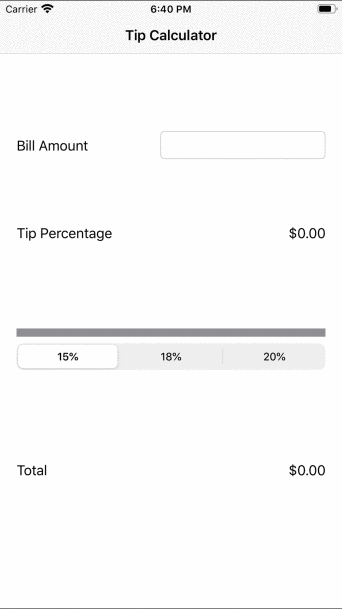

# Tip Calculator
Tip Calculator is an iOS app to calulate a tip.

## Version 1: Segmented Control
The initial app used a segmented control to select between a 15%, 18%, and 20% tip rate. The app defaults to using 15% if nothing is selected.

## Version 2: Slider
The segmented control was replaced with a slider so that any percent between 0% and 100% could be selected. The app still defaults to using 15%.

